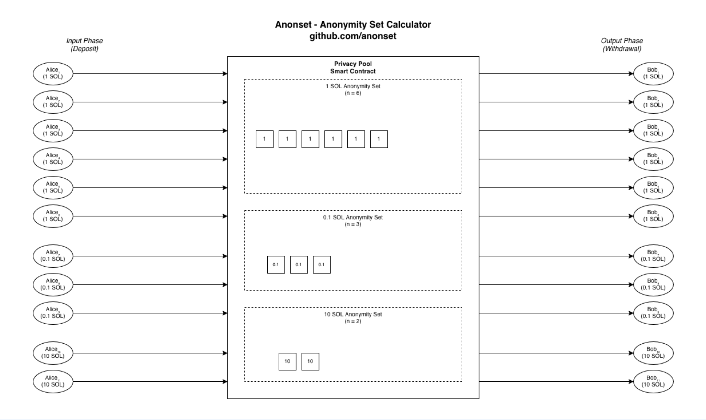

# Anonset

  

Calculate the anonymity set (anonset) of a Solana pool.

<div align="center">  </div>


## 🔌 Installation

Install using pip:

```bash
pip install git+https://github.com/anonset/anonset.git
```

## 🔩 Usage

Provide an address to scan and optionally a custom RPC URL and transaction limit.

```bash
anonset --address ADDRESS [--rpc RPC_URL] [--limit LIMIT]
```

## 🐣 Example

Calculate the anonymity sets of PrivacyCash (4AV2Qzp3N4c9RfzyEbNZs2wqWfW4EwKnnxFAZCndvfGh)

```bash
anonset --address 4AV2Qzp3N4c9RfzyEbNZs2wqWfW4EwKnnxFAZCndvfGh --limit 1000
```

```md
╔═══════════════════════════════════════════════════════════════════════════════════ Data ═╗
║ Address scanned        : 4AV2Qzp3N4c9RfzyEbNZs2wqWfW4EwKnnxFAZCndvfGh                    ║
║ Total time scanned     : 40 hours 30 minutes                                             ║
║ Script duration        : 369.28 seconds                                                  ║
╚══════════════════════════════════════════════════════════════════════════════════════════╝

╔═════════════════════════════════════════════════════════════════════════ Anonymity Sets ═╗
║           VALUE (SOL) │ ANONYMITY SET │ HISTOGRAM                                        ║
║               1 ◎ SOL │            32 │ ################################                 ║
║              10 ◎ SOL │            25 │ #########################                        ║
║             0.1 ◎ SOL │            22 │ ######################                           ║
║               5 ◎ SOL │            21 │ #####################                            ║
║              20 ◎ SOL │            19 │ ###################                              ║
║             0.5 ◎ SOL │            13 │ #############                                    ║
╚══════════════════════════════════════════════════════════════════════════════════════════╝

╔═════════════════════════════════════════════════════════════════════════════════ Volume ═╗
║ Transactions           : 3000  (Deposits: 1180, Withdrawals: 1765)                       ║
║ Volume                 : 32168.74 SOL                                                    ║
╚══════════════════════════════════════════════════════════════════════════════════════════╝
```

## 📕 Docstring

```bash
NAME
       anonset - calculate anonymity set

SYNOPSIS
       anonset --address ADDRESS [--rpc RPC_URL] [--limit LIMIT]

DESCRIPTION
       Fetches  recent  transactions  for  a  Solana  address,  calculates
       anonymity  sets by grouping identical SOL balance changes, and dis-
       plays results with ASCII histograms and summary tables.

OPTIONS
       --address ADDRESS
              Solana account address to analyze (required)

       --rpc RPC_URL
              RPC endpoint URL (default: https://solana-rpc.publicnode.com)

       --limit LIMIT
              Number of recent transactions to scan (default: 100)
```
----

[GitHub]: https://github.com/anonset
[Docs]: https://anonset.github.io/
